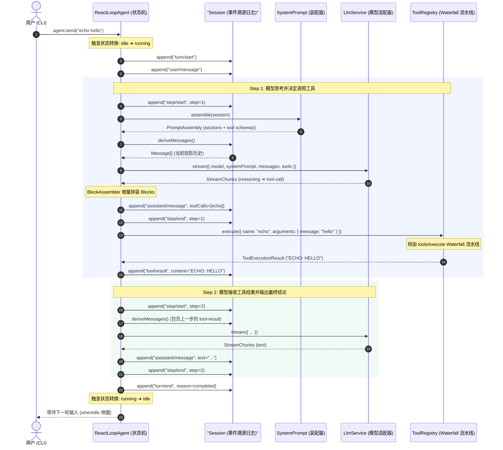

# DeepSeek Coding Agent 从 0 到 1 搭建指南

> **阶段**：Milestone 1 — 骨架、内核与最简 Echo Agent 闭环  
> **代码仓库**：[mini-harness](file:///Users/wj/demo/mini-harness)  
> **参考来源**：[deepseek-harness](file:///Users/wj/demo/deepseek-harness)

---

## 一、设计哲学与心智模型 (Mental Model)

要理解 DeepSeek Coding Agent（即 `deepseek-harness`）的代码，必须先理解它的两大核心架构支柱：**微内核插件系统（Microkernel）** 与 **事件溯源会话系统（Event-Sourcing Session）**。

```
┌─────────────────────────────────────────────────────────────┐
│                       UI / App 接入层                        │
│             (Stdio CLI / ACP 编辑器协议桥接)                │
├─────────────────────────────────────────────────────────────┤
│                    ReAct Agent Loop 引擎                    │
│             (Session ➔ Turn ➔ Step 状态机)                 │
├─────────────────────────────────────────────────────────────┤
│                         核心服务层                          │
│  SessionStore │ SystemPrompt │ ToolRegistry │ LlmService    │
├─────────────────────────────────────────────────────────────┤
│                      微内核容器 (Cordis)                     │
│         Context │ Service │ Events │ Waterfall │ HMR         │
└─────────────────────────────────────────────────────────────┘
```

### 1. 为什么采用“微内核架构 (Microkernel)”？
* **传统 Agent 框架的弊端**：大多数通用框架（如 LangChain）将逻辑硬编码在特定的类继承链中，导致工具拦截、权限检查、提示词动态组装、沙箱执行等横切关注点（Cross-cutting Concerns）互相耦合。
* **微内核的设计**：**Everything is a plugin（一切皆插件）**。核心系统只提供一个极简的上下文容器（`Context`）和生命周期管理。
  * `ToolRegistry` 是插件（向容器提供 `ctx.tools`）；
  * `LlmService` 是插件（向容器提供 `ctx.llm`）；
  * `SessionStore` 是插件（向容器提供 `ctx.sessions`）；
  * `AgentRegistry` 是插件（向容器提供 `ctx.agents`）；
  * `AgentLoop` 是插件（向容器提供 `ctx.agentLoop`）。
* **响应式依赖注入（`static inject`）**：
  * 各服务声明自身依赖（例如 `ToolRegistry` 声明 `static inject = ['systemPrompt']`，`AgentLoop` 声明 `static inject = ['llm', 'sessions', 'systemPrompt', 'tools', 'agents']`）；
  * 即使服务被外部乱序加载，Cordis 也会自动挂起依赖未满足的服务，在依赖全部就绪的瞬间自动激活，彻底实现模块间的**声明式解耦与加载安全**。
* **Waterfall 中间件流水线**：
  * 后续的权限确认、沙箱检查、持久化，都不需要修改 Agent Loop 的主循环代码，而是通过 **Waterfall 中间件** 或 **事件监听** 自动介入。

---

### 2. 为什么采用“事件溯源 (Event Sourcing)”？

在真正的 Coding Agent 中，交互历史远比普通 ChatBot 复杂：模型会输出推理思考过程（Reasoning）、发起结构化工具调用（Tool Calls）、接收环境与文件状态注入（Context Injection）、中途被用户插话打断（Steering/Cancellation）。

#### (1) 核心心智模型：“存银行余额” vs “存银行流水账”
* **传统做法（存余额）**：在内存或数据库里直接维护并频繁修改一个可变的 `messages[]` 数组。
* **事件溯源做法（存流水账）**：会话是一份**单向追加、不可篡改的事件日志（Append-only Event Log）**，记录系统生命周期中发生的每一个客观事实。

#### (2) 传统存 `messages[]` 在 Coding Agent 中的 4 大致命痛点

| 痛点维度 | 传统做法（直接存 `messages[]`） | 事件溯源做法（存不可变 `SessionEvent[]`） |
| :--- | :--- | :--- |
| **存储本质** | **“当前状态结果”**（容易丢失过程细节） | **“不可推翻的发生过程”**（永不丢失细节，随时可从流水计算状态） |
| **可变性与并发** | 可变（在原数组上 push、pop、修改，极易并发脏写） | **完全不可变（单向追加 Append-only，使用 `structuredClone` 深拷贝）** |
| **执行元数据** | 弱（只有文本，丢失 Turn/Step 轮次、Token 消耗、耗时） | **强（精准记录每一步的起止时刻、Token 统计、调用 ID 与错误状态）** |
| **异常恢复与容灾** | 难（断电或崩溃后半截状态死无对证，易造成重复工具执行事故） | **极易（按 seq 重放流水即可 100% 原地还原现场或断点续传）** |
| **撤销与会话分叉** | 破坏性修改，难以回滚到过去的指定步骤 | **极其简单（截取前 N 条事件即可无损分叉出新会话分支 Fork）** |

#### (3) 双层持久化机制（Two-Tier Persistence）
* **第一层：WAL 实时预写日志 (`session/event`)**：
  * 每当调用 `session.append()` 产生一条事件（如工具调用、模型回复），立刻同步广播 `session/event`；
  * 持久化插件监听到后**实时追加写入磁盘 `.jsonl` 文件**，即便下一毫秒断电，已执行的操作也绝不会丢失。
* **第二层：轮次事务刷盘与元数据更新 (`session/flush`)**：
  * 当一轮对话在 `drainInbox()` 的 `finally` 块彻底结束时，触发 `await ctx.parallel('session/flush', session)`；
  * 通知所有持久化插件强制调用 `fsync` 刷盘，并更新数据库主表的聚合状态。

#### (4) 纯函数消息投影（Message Projection）
* 大模型需要的 `messages[]` 数组，只是事件流水的一个**“只读视图（Read View）”**。
* 每次调用 LLM 前，通过 [`deriveMessages(events)`](file:///Users/wj/demo/mini-harness/src/session/index.ts#L60) 纯函数动态投影计算，彻底杜绝了并发污染与历史篡改。

---

## 二、Milestone 1 整体数据流与生命周期



---

## 三、各模块实现细节与代码拆解

### 1. 核心协议与词表 ([`src/types/`](file:///Users/wj/demo/mini-harness/src/types))

#### (1) `blocks.ts` — 结构化内容块模型
大模型的消息内容不是单纯的 `string`，而是由四种基础 Block 构成的结构化数组：
* `TextBlock`: 普通文本输出。
* `ReasoningBlock`: 模型的思考过程（DeepSeek-R1 / V3 的 `<think>` 内容）。
* `ToolCallBlock`: 模型发起的结构化工具调用（ID、函数名、入参 JSON 对象）。
* `ToolResultBlock`: 工具执行后的返回值（携带对应 `toolCallId` 和 `isError` 状态）。

#### (2) `stream.ts` — 流式分片协议与 `BlockAssembler`
* **协议分片定义**：
  * 分块生命周期：`block-start`（声明分块类型与 index）、`block-end`（封存完整分块对象）；
  * 增量数据分片：`text-delta`、`reasoning-delta`、`tool-call-delta`；
  * 元数据分片：`usage`（Token 消耗统计）、`finish`（结束原因：`stop` / `tool-use` / `length`）。
* **`BlockAssembler` 聚合器核心设计**：
  * **按 index 隔离维护**：使用 `partials: Map<number, PartialBlock>` 精确管理多块交织流（支持同时存在思考流和多个并发工具调用流）；
  * **顺序记录**：使用 `order: number[]` 严格保序，确保最终还原出的 Block 顺序与模型生成时序完全一致；
  * **封箱防护锁（`partial.block`）**：
    * 当收到 `block-end` 时，上游适配器已解析好的成品会赋值给 `partial.block`；
    * 一旦 `partial.block` 存在，后续任何偶发的延迟乱序分片都会通过 `if (partial.block) return` 被直接丢弃，**杜绝脏数据污染**；
  * **安全物化与缓存加速**：在调用 `blocks()` 导出时，若 `partial.block` 已存在则直接取用，否则安全执行 `JSON.parse` 参数反序列化，解析失败时优雅回退为 `{ _raw: ... }`。

#### (3) `session.ts` — 11 类不可变事件契约
定义了强类型的 `SessionEventMap`：
* **生命周期事件**：`turn/start`（记录 trigger 来源）, `turn/end`（记录 `TurnEndReason`，如 `completed` / `error` / `aborted`）, `step/start`, `step/end`；
* **对话内容事件**：`user/message`（用户输入）, `assistant/chunk`（流式增量备份）, `assistant/message`（固化的模型回复与 Token 使用量）；
* **工具交互事件**：`tool/call`（发起的工具调用明细）, `tool/result`（工具执行输出或异常）；
* **高级干预事件**：`context/message`（环境与文件上下文注入）, `steering/message`（用户中途纠偏干预）。

---

### 2. 会话事件溯源与消息派生 ([`src/session/index.ts`](file:///Users/wj/demo/mini-harness/src/session/index.ts))

* **`Session` 类**：
  * 维护核心日志 `private log: SessionEvent[]`；
  * `append(type, data)`：使用原生 `structuredClone` 深拷贝数据，分配单调自增序号 `seq`，并同步触发 `session.onAppend` ➔ 广播 `'session/event'`；
  * **种子恢复支持**：构造函数支持传入 `seed?: SessionEvent[]`，允许系统从磁盘历史记录原地 100% 内存重建拥有完整上下文的 Session 实例。
* **`deriveMessages(): Message[]` 纯函数投影规则**：
  * 遍历 `this.log` 中的事件流，映射为大模型 API 所需的标准结构：
    * `user/message` ➔ 投影为 `role: 'user'` 消息；
    * `assistant/message` ➔ 投影为 `role: 'assistant'` 消息（包含文本、思考和工具调用）；
    * `tool/result` ➔ 投影为携带 `tool-result` 块的 `role: 'user'` 消息；
    * `context/message` ➔ 投影为包裹着 `<context source="...">...</context>` XML 标签的系统上下文文本；
    * `steering/message` ➔ 投影为包裹着 `<steering source="...">...</steering>` XML 标签的用户纠偏提示；
  * 自动过滤非消息事件（如 `turn/start`, `step/start`, `assistant/chunk` 等仅用于追踪回放的元事件）。

---

### 3. 提示词装配与工具流水线 ([`src/system-prompt/`](file:///Users/wj/demo/mini-harness/src/system-prompt/index.ts) & [`src/tools/`](file:///Users/wj/demo/mini-harness/src/tools/index.ts))

* **双层提示词组合机制**：
  1. **全局平台级提示词**（`ctx.systemPrompt.section`）：所有 Agent 共享的底层基础人设与规范，支持 `order` 升序权重排序；
  2. **实例专属提示词**（`createAgent({ systemPrompt })`）：特定 Agent 的个性化角色设定（如代码审查员、翻译官）；
  3. **合并生效**：在 AgentLoop 中通过 `[renderPrompt(assembly), this.options.systemPrompt].filter(Boolean).join('\n\n')` 合并后发给模型。
* **JSON Schema 工具规范**：
  * `ctx.tools.register` 的 `parameters` 采用大模型通用的标准 JSON Schema 规范（`type: 'object'`, `properties`, `required`, `description`），无缝兼容 DeepSeek、OpenAI 与 Claude 官方 API。
* **`tools/execute` Waterfall 中间件流水线**：
  ```ts
  const defaultRunner = async () => {
    const tool = this.tools.get(exec.name)
    if (!tool) throw new Error(`Tool not found: ${exec.name}`)
    return await tool.execute(exec.arguments)
  }
  return await this.ctx.waterfall(this, 'tools/execute', exec, defaultRunner)
  ```
  > 💡 **架构优势**：未来如果要添加 **“用户在终端按 Y 确认后才执行危险命令”**、**“参数安全拦截”** 或 **“Docker 隔离沙箱”**，只需编写独立插件监听 `tools/execute`，在中间调用 `next()` 或直接返回拦截结果，完全无需修改工具实现本身！

---

### 4. 模型服务抽象与 Mock 适配器 ([`src/llm/`](file:///Users/wj/demo/mini-harness/src/llm/index.ts))

* **`LlmService` 网关**：
  * 维护模型名称与适配器的路由映射表（`registerAdapter(models, adapter)`）；
  * 统一暴露 `stream(options): AsyncIterable<StreamChunk>`，通过 `yield* adapter.stream(options)` 实现流式透传。
* **`MockLlmAdapter` 高仿真模拟器**（精准模拟真实大模型在两阶段 ReAct 循环中的行为）：
  1. **分支 1（Step 2 场景）**：检测到消息列表尾部出现了 `tool-result`，流式输出最终处理答复，结束原因为 `finish: { kind: 'stop' }`；
  2. **分支 2（Step 1 场景）**：识别到用户输入了 `echo ...` 指令，先流式输出 Reasoning 思考流（`[Reasoning] User wants to echo...`），紧接着流式发出 `tool-call` 结构化参数分片，结束原因为 `finish: { kind: 'tool-use' }`；
  3. **分支 3（普通闲聊场景）**：直接逐字输出普通文本引导提示，结束原因为 `finish: { kind: 'stop' }`。

---

### 5. ReAct Agent Loop 状态机 ([`src/agent-loop/index.ts`](file:///Users/wj/demo/mini-harness/src/agent-loop/index.ts))

这是整个系统的中央调度“大脑”：
* **状态机与队列管理**：
  * `send(content)`：非阻塞消息投递，将用户消息推入 `inbox` 收件箱；
  * `drainInbox()`：状态从 `idle` 切换到 `running`，顺序消费收件箱中的轮次；
  * `whenIdle()`：异步等待屏障，返回挂起的 Promise，直到 Agent 完成所有步骤切回 `idle` 状态后自动唤醒。
* **单轮 ReAct 核心循环（`runTurn`）**：
  * 步数防御控制（默认 `maxSteps = 10`，防止大模型陷入工具死循环）；
  * **工具调用 5 步闭环**：
    1. **意图提取**：从 `assistantBlocks` 筛选出所有的 `tool-call`；
    2. **广播通知**：触发 `emit('agent/tool-call')`，供 UI 实时渲染黄色调用卡片；
    3. **真实执行**：调用 `await ctx.tools.execute(...)` 真正执行业务代码；
    4. **记录与广播**：向 Session 写入 `tool/result` 事件并触发 `emit('agent/tool-result')`；
    5. **自动进入 Step 2**：`deriveMessages()` 自动将上一步的工具结果反哺给大模型，驱动模型输出最终回答！

---

### 6. 控制台交互、工程化体系与调试指南

* **Stdio UI ([`src/ui/stdio.ts`](file:///Users/wj/demo/mini-harness/src/ui/stdio.ts))**：
  * 基于 Node 原生 `readline` 模块实现 REPL 命令行交互；
  * 订阅 `agent/chunk` 实时打字机打印思考过程与助手回复；
  * `currentBlockType` 状态标志：确保流式打字时 `[Reasoning]` 和 `[Assistant]` 标题只打印一次，切换分块时自动换行加前缀，保证排版整洁；
  * 订阅 `agent/tool-call` 和 `agent/tool-result` 打印工具调用的彩色卡片。
* **单元测试覆盖 ([`tests/echo.spec.ts`](file:///Users/wj/demo/mini-harness/tests/echo.spec.ts))**：
  * 端到端测试完整的 2-Step ReAct 闭环；
  * 严谨断言不可变事件日志中的完整时序：`turn/start` ➔ `step/start(1)` ➔ `tool/call` ➔ `tool/result` ➔ `step/start(2)` ➔ `turn/end`。
* **工程化配置**：
  * **纯 ESM 模块体系**：`package.json` 设置 `"type": "module"`；
  * **极速 JIT 开发体验**：使用 `tsx`（基于 esbuild）直接运行 TypeScript 源码，无需预编译落盘；
  * **纯内存类型门禁**：`npm run typecheck` (`tsc --noEmit`)；
  * **现代测试框架**：`npm test` (`vitest run`)。
* **开发与调试方案**：
  1. **VSCode 原生断点调试（F5 启动）**：项目中已配置 [`.vscode/launch.json`](file:///Users/wj/demo/mini-harness/.vscode/launch.json)，支持一键断点调试 Demo、单测与当前 TS 文件；
  2. **JavaScript Debug Terminal（零配置）**：在 VSCode 中直接打开 Debug Terminal 运行 `npm run demo:echo`，可直接命中断点；
  3. **微内核事件追踪**：在入口处添加 `ctx.on('session/event', ...)` 即可在控制台实时打印全生命周期的数据流动轨迹。

---

## 四、演进总览：后续 Milestone 规划

| 里程碑 | 核心目标 | 引入的核心技术点 |
| :--- | :--- | :--- |
| **Milestone 1 (已完成)** ✅ | **骨架与最简 Echo Agent 闭环** | Microkernel 容器、BlockAssembler、事件溯源 Session、ReAct Loop、Stdio CLI |
| **Milestone 2 (下一阶段)** 🚀 | **真实能力注入 (Coding Agent)** | 真实 DeepSeek API (SSE/Fetch)、本地 Bash 进程组执行器、`bash` 工具 |
| **Milestone 3** | **工业级持久化与容灾恢复** | JSONL 追加日志、SQLite 存储、崩溃安全检测与 `ctx.agents.resume()` |
| **Milestone 4** | **编辑器集成 (ACP 协议)** | Agent Client Protocol (JSON-RPC stdio 协议网关)、对接 Zed / IDE |
| **Milestone 5** | **系统加固与高级控制** | Invariants 不变量契约校验、中途 Steering 插入、优雅 Cancellation |

---
*文档归档于 `/Users/wj/demo/mini-harness/docs/01-milestone1-echo-agent.md`。*
