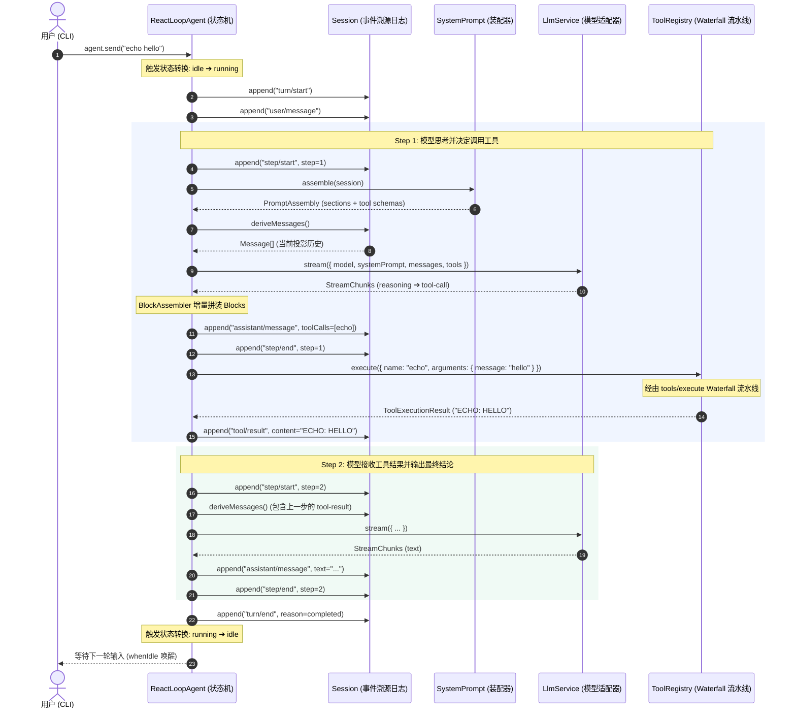

# DeepSeek Coding Agent 从 0 到 1 搭建指南

> **阶段**：Milestone 1 — 骨架、内核与最简 Echo Agent 闭环  
> **代码仓库**：[mini-harness](file:///Users/wj/demo/mini-harness)  
> **参考来源**：[deepseek-harness](file:///Users/wj/demo/deepseek-harness)

---

## 一、设计哲学与心智模型 (Mental Model)

要理解 DeepSeek Coding Agent（即 `deepseek-harness`）的代码，必须先理解它的两大核心架构支柱：**微内核插件系统（Microkernel）** 与 **事件溯源会话系统（Event-Sourcing Session）**。

```
┌─────────────────────────────────────────────────────────────┐
│                       UI / App 接入层                        │
│             (Stdio CLI / ACP 编辑器协议桥接)                │
├─────────────────────────────────────────────────────────────┤
│                    ReAct Agent Loop 引擎                    │
│             (Session ➔ Turn ➔ Step 状态机)                 │
├─────────────────────────────────────────────────────────────┤
│                         核心服务层                          │
│  SessionStore │ SystemPrompt │ ToolRegistry │ LlmService    │
├─────────────────────────────────────────────────────────────┤
│                      微内核容器 (Cordis)                     │
│         Context │ Service │ Events │ Waterfall │ HMR         │
└─────────────────────────────────────────────────────────────┘
```

### 1. 为什么采用“微内核架构 (Microkernel)”？
* **传统 Agent 框架的弊端**：大多数通用框架（如 LangChain）将逻辑硬编码在特定的类继承链中，导致工具拦截、权限检查、提示词动态组装、沙箱执行等横切关注点（Cross-cutting Concerns）互相耦合。
* **微内核的设计**：**Everything is a plugin（一切皆插件）**。核心系统只提供一个极简的上下文容器（`Context`）和生命周期管理。
  * `ToolRegistry` 是插件（向容器提供 `ctx.tools`）；
  * `LlmService` 是插件（向容器提供 `ctx.llm`）；
  * 后续的权限确认、沙箱检查、持久化，都不需要修改 Agent Loop 的主循环代码，而是通过 **Waterfall 中间件** 或 **事件监听** 自动介入。

### 2. 为什么采用“事件溯源 (Event Sourcing)”？
* **为什么不直接存 `messages[]`？**  
  在真正的 Coding Agent 中，交互历史远比单轮对话复杂：模型会输出思考过程（Reasoning）、发起多个工具调用（Tool Calls）、接收系统注入的只读上下文（Context Injection，如修改的文件通知、环境信息），甚至中途被用户打断（Steering/Cancellation）。
* **事件溯源的核心逻辑**：
  * **唯一事实来源（Single Source of Truth）**：会话是一份**单向追加的事件日志（Append-only Event Log）**，记录了发生的每一个动作（`user/message`, `assistant/chunk`, `tool/call`, `tool/result`, `turn/start`, `turn/end`）。
  * **纯函数消息投影（Message Projection）**：每次调用 LLM 前，通过 `deriveMessages(events)` 纯函数，根据事件流动态“投影计算”出标准的消息数组。
  * **收益**：彻底杜绝了并发读写污染、历史记录篡改，使**断点重放、分支分叉（Fork Session）、崩溃持久化恢复**变得极其简单。

---

## 二、Milestone 1 整体数据流与生命周期



---

## 三、各模块实现细节与代码拆解

### 1. 核心协议与词表 ([`src/types/`](file:///Users/wj/demo/mini-harness/src/types))

#### (1) `blocks.ts` — 内容块模型
LLM 的消息内容不是单纯的 `string`，而是由四种基础块构成的数组：
* `TextBlock`: 普通文本输出。
* `ReasoningBlock`: 模型的思考过程（DeepSeek R1/V3 的 `<think>` 内容）。
* `ToolCallBlock`: 模型发起的结构化工具调用（ID、函数名、入参 JSON）。
* `ToolResultBlock`: 工具执行后的返回值（携带对应 `toolCallId` 和 `isError` 状态）。

#### (2) `stream.ts` — 流式分片协议与 `BlockAssembler`
* **协议分片**：定义了 `block-start`、`text-delta`、`reasoning-delta`、`tool-call-delta`、`block-end`、`usage`、`finish` 等细粒度流式事件。
* **`BlockAssembler` 累加器**：流式协议的核心。它在内存中维护各个 Block 索引的局部状态（Partial），流式接收 Delta 字符并追加，在收到 `block-end` 或流结束时输出格式完整、参数已被合法解析的 `ContentBlock[]`。

#### (3) `session.ts` — 事件日志类型
* 定义了不可变日志项 `SessionEvent<T>`：
  ```ts
  export type SessionEvent<K extends SessionEventType = SessionEventType> = {
    [T in SessionEventType]: {
      type: T
      seq: number    // 单调自增序号 0, 1, 2...
      time: number   // 时间戳
      data: SessionEventMap[T]
    }
  }[K]
  ```

---

### 2. 会话事件溯源与消息派生 ([`src/session/index.ts`](file:///Users/wj/demo/mini-harness/src/session/index.ts))

* **`Session` 类**：
  * 拥有 `private log: SessionEvent[]`。
  * `append(type, data)`：负责将事件深拷贝（`structuredClone`）压入日志，分配单调递增的 `seq`，并同步触发 `session/event` 事件（供 UI、日志器或持久化组件实时消费）。
* **`deriveMessages(): Message[]`**：
  * 遍历 `this.log` 中的事件：
    * `user/message` ➔ 投影为 `role: 'user'` 消息。
    * `assistant/message` ➔ 投影为 `role: 'assistant'` 消息。
    * `tool/result` ➔ 投影为携带 `tool-result` 块的 `role: 'user'` 消息。
    * `context/message` / `steering/message` ➔ 投影为包裹着 `<context source="...">` 标签的系统提示文本。
  * 过滤掉非消息事件（如 `turn/start`, `step/start`, `assistant/chunk` 等只用于重放和监控的元事件）。

---

### 3. 提示词装配与工具流水线 ([`src/system-prompt/`](file:///Users/wj/demo/mini-harness/src/system-prompt/index.ts) & [`src/tools/`](file:///Users/wj/demo/mini-harness/src/tools/index.ts))

* **`SystemPrompt` 服务**：
  * 支持多模块注册段落（Sections），每个段落带有 `name`、`order`（升序排序）和 `text`。
  * `assemble()` 时收集所有 Section 文本与已注册工具的 JSON Schema，并通过 `system-prompt/assemble` Waterfall 允许其他插件在装配前最后修改提示词。
* **`ToolRegistry` 服务**：
  * 依赖注入 `inject = ['systemPrompt']`，初始化时自动将自身拥有的 Tool Schema 注册给 `SystemPrompt`。
  * `execute(exec)` 执行工具时，封装在 `tools/execute` Waterfall 中：
    ```ts
    const defaultRunner = async () => { ... }
    return await this.ctx.waterfall(this, 'tools/execute', exec, defaultRunner)
    ```
    > 💡 **架构优势**：未来如果要添加 **“用户在终端按 Y 确认后才执行危险命令”** 或 **“Docker 隔离沙箱”**，只需写一个插件监听 `tools/execute`，在中间调用 `next()` 或直接返回 veto 结果即可，完全不需要改动工具本身！

---

### 4. 模型服务抽象与 Mock 适配器 ([`src/llm/`](file:///Users/wj/demo/mini-harness/src/llm/index.ts))

* **`LlmService`**：
  * 维护模型名称与 `LlmAdapter` 的映射关系（`registerAdapter(models, adapter)`）。
  * 统一暴露 `stream(options): AsyncIterable<StreamChunk>` 生成器。
* **`MockLlmAdapter`**：
  * 精准模拟了真实大模型的两阶段行为：
    1. **第一阶段**：识别到用户要执行 `echo`，流式输出 Reasoning 思考流（`[Reasoning] User wants to echo...`），接着流式发出 `tool-call` 分片（`name: 'echo', arguments: { message: ... }`），结束原因为 `tool-use`。
    2. **第二阶段**：检测到消息列表尾部出现了 `tool-result`，流式输出最终解释文本，结束原因为 `stop`。

---

### 5. ReAct Agent Loop 状态机 ([`src/agent-loop/index.ts`](file:///Users/wj/demo/mini-harness/src/agent-loop/index.ts))

这是整个框架的“大脑”：
* **状态机管理**：
  * 内部维护 `inbox` 消息队列和 `idleWaiters` 等待池。
  * 当调用 `agent.send(text)` 时，消息入队并触发 `drainInbox()`。
  * 状态从 `idle` 切换到 `running`，执行 `runTurn(turn, blocks)`。
* **Step 循环控制**：
  * 在单个 Turn 内运行 `step = 1 ... maxSteps` 循环。
  * 每一步执行标准流水线：`Prompt Assembly` ➔ `deriveMessages` ➔ `LLM Stream` ➔ `BlockAssembler` ➔ `Tool Execution`。
  * 当模型不再发出 `tool-call` 或者触发终止条件（如 `completed`, `aborted`, `error`）时，跳出 Step 循环，写入 `turn/end`，状态切回 `idle`，并唤醒所有 `whenIdle()` 挂起的调用者。

---

### 6. 控制台交互与端到端测试

* **Stdio UI ([`src/ui/stdio.ts`](file:///Users/wj/demo/mini-harness/src/ui/stdio.ts))**：
  * 基于 Node 原生 `readline` 模块。
  * 订阅 `agent/chunk` 实时打印打字机效果的思考过程与回复。
  * 订阅 `agent/tool-call` 和 `agent/tool-result` 打印工具调用的彩色卡片。
* **单元测试 ([`tests/echo.spec.ts`](file:///Users/wj/demo/mini-harness/tests/echo.spec.ts))**：
  * 断言 2-step ReAct 循环全部跑通。
  * 断言事件日志中完整记录了 `turn/start` ➔ `step/start(1)` ➔ `tool/call` ➔ `tool/result` ➔ `step/start(2)` ➔ `turn/end` 的严格时序。

---

## 四、演进总览：后续 Milestone 规划

| 里程碑 | 核心目标 | 引入的核心技术点 |
| :--- | :--- | :--- |
| **Milestone 1 (已完成)** ✅ | **骨架与最简 Echo Agent 闭环** | Microkernel 容器、BlockAssembler、事件溯源 Session、ReAct Loop、Stdio CLI |
| **Milestone 2 (下一阶段)** 🚀 | **真实能力注入 (Coding Agent)** | 真实 DeepSeek API (SSE/Fetch)、本地 Bash 进程组执行器、`bash` 工具 |
| **Milestone 3** | **工业级持久化与容灾恢复** | JSONL 追加日志、SQLite 存储、崩溃安全检测与 `ctx.agents.resume()` |
| **Milestone 4** | **编辑器集成 (ACP 协议)** | Agent Client Protocol (JSON-RPC stdio 协议网关)、对接 Zed / IDE |
| **Milestone 5** | **系统加固与高级控制** | Invariants 不变量契约校验、中途 Steering 插入、优雅 Cancellation |

---
*文档生成于 `/Users/wj/demo/mini-harness` 初始构建阶段。*
