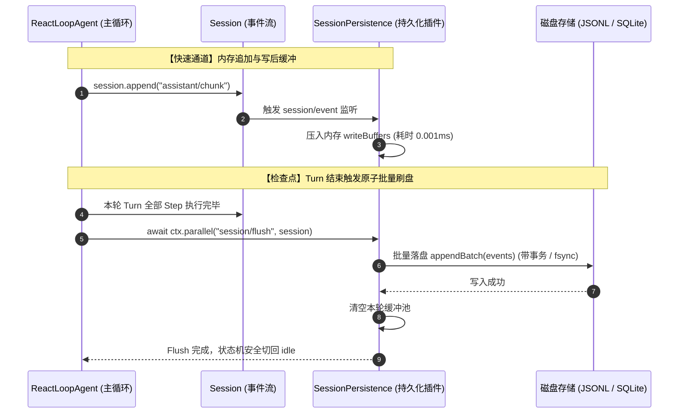
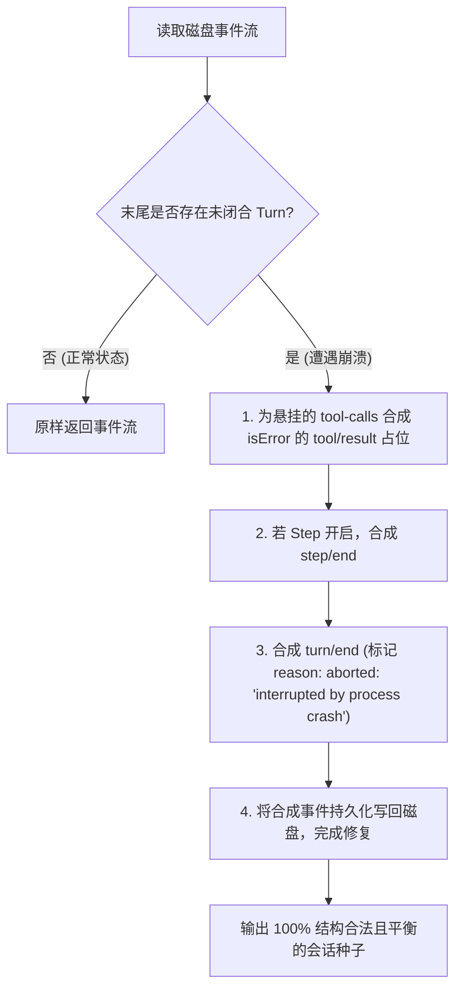

# DeepSeek Coding Agent 从 0 到 1 搭建指南

> **阶段**：Milestone 3 — 工业级持久化：JSONL / SQLite 追加日志与崩溃恢复 `ctx.agents.resume()`  
> **代码仓库**：[mini-harness](file:///Users/wj/demo/mini-harness)  
> **参考来源**：[deepseek-harness](file:///Users/wj/demo/deepseek-harness)

---

## 一、Milestone 3 核心使命与架构设计

在 Milestone 1 和 Milestone 2 中，我们的 Agent 已经拥有了完整的 ReAct 状态机以及调用本地 Bash 命令的能力。但所有的交互历史和事件流都保存在 Node.js 进程内存中，**进程一旦退出或崩溃，上下文全部丢失**。

在 **Milestone 3** 中，我们将为 Agent 注入**工业级记忆能力与容灾恢复机制**：
1. **统一持久化 Seam 抽象（`SessionPersistence`）**：定义标准的存储契约，彻底隔离上层状态机与底层存储介质；
2. **写后缓冲池（Write-Behind Buffer）与 Flush 检查点**：主循环热路径零 I/O 阻塞，在每轮 Turn 结束时原子增量落盘；
3. **崩溃恢复修复算法（Crash-Recovery Repair）**：进程在执行中途异常被杀时，重新加载时自动合成最小闭合边界，保证历史记录始终合法；
4. **JSONL 与 SQLite 双后端实现**：支持极简文本日志与高性能原生 SQLite 数据库（基于 Node 24 原生 `node:sqlite`，零第三方依赖）；
5. **无缝断点续聊（`ctx.agentLoop.resumeAgent()`）**：通过指定 Session ID，跨进程完整重水化（Rehydrate）历史上下文，无缝续接任务。

```
┌─────────────────────────────────────────────────────────────┐
│                    coding-agent (真实应用)                  │
│               (支持 RESUME_SESSION_ID 跨进程续聊)           │
├─────────────────────────────────────────────────────────────┤
│                    ReAct Agent Loop 引擎                    │
│             (每轮 Turn 结束触发 session/flush 检查点)       │
├─────────────────────────────────────────────────────────────┤
│                 SessionPersistence 统一持久化 Seam          │
│               (Write-Behind 缓冲池 + 崩溃恢复修补)           │
│                                                             │
│   ┌─────────────────────────┐     ┌──────────────────────┐  │
│   │ JsonlSessionPersistence │     │ SqlitePersistence    │  │
│   │ (.sessions/*.jsonl)     │     │ (node:sqlite 原生WAL)│  │
│   └─────────────────────────┘     └──────────────────────┘  │
├─────────────────────────────────────────────────────────────┤
│                      微内核容器 (Cordis)                     │
│               Context │ Tools │ Session │ Prompt            │
└─────────────────────────────────────────────────────────────┘
```

---

## 二、写后缓冲与 Flush Checkpoint 设计模式

在实时交互与大模型流式调用场景下，事件产生频率极高（例如每秒数十个 `assistant/chunk`）。如果每次 `session.append()` 都直接执行磁盘 I/O（如 `fs.write` 或 `DB.insert`），会导致：
* 主循环被磁盘 I/O 频繁阻塞，极大增加首字与打字机流式延迟；
* 大量碎片小写入严重浪费磁盘 IOPS。

### 🚀 设计解法：Write-Behind Buffer + Flush 检查点



---

## 三、崩溃恢复修复算法（Crash-Recovery Repair）

### 1. 现实中的灾难场景
假设 Agent 在执行耗时较长的构建任务（如 `npm run build`），大模型发出了 `tool-call`。此时用户强行按下了 `Ctrl+C` 杀死进程，或者系统因为 OOM 杀死了进程。此时磁盘上记录的状态为：
1. `turn/start` (Turn 1 开启)
2. `user/message` ("帮我构建项目")
3. `step/start` (Step 1 开启)
4. `assistant/message` (包含 `tool-call: { id: "call_99", name: "bash" }`)
5. 💥 **进程在此时突然崩溃死亡！**

### 2. 为什么不能直接扔掉？为什么不能原样重放？
* **如果直接丢弃未闭合的 Turn**：在长周期 Coding 任务中，单轮 Turn 可能包含数十步探索与大量有效输出，直接截断会导致之前的努力全白费。
* **如果直接把未闭合的记录送给 LLM**：几乎所有大模型供应商（OpenAI、DeepSeek、Anthropic）均强制要求：**如果 Assistant 消息中出现了 `tool_calls`，后续必须紧跟对应 `tool_call_id` 的 `tool` 结果消息**。否则 API 会直接抛出 `400 Invalid Transcript: Dangling tool calls` 错误！

### 3. 智能合成最小闭合边界 ([`src/session/repair.ts`](file:///Users/wj/demo/mini-harness/src/session/repair.ts))
当后端从磁盘加载未完整闭合的日志时，算法会自动扫描并**就地合成最小合法闭合事件**：



---

## 四、双后端对比与通用契约验证

`mini-harness` 提供了两种开箱即用的工业级持久化后端：

| 特性维度 | JSONL 后端 (`JsonlSessionPersistence`) | SQLite 后端 (`SqliteSessionPersistence`) |
| :--- | :--- | :--- |
| **存储形态** | 每会话独立 `.sessions/{id}.jsonl` 文本文件 | 单个 `.sessions/sessions.db` 数据库文件 |
| **人类可读性** | 极佳（可用 `cat`、`grep`、`tail -f` 实时排查） | 需要 SQLite 工具查看 |
| **Git / 审计友好** | 行级追加，天然适配文本版本管理 | 二进制存储 |
| **并发与 ACID 事务** | 基于文件原子写与追加锁 | 基于 WAL 模式与强 ACID 事务 |
| **依赖情况** | 纯 Node 原生 `node:fs/promises` | 纯 Node 24 原生 `node:sqlite`（**零 npm 依赖**） |

### 通用契约测试（Contract Testing）
在 [`tests/session-persistence.spec.ts`](file:///Users/wj/demo/mini-harness/tests/session-persistence.spec.ts) 中，我们编写了标准化的持久化契约测试套件，**JSONL 和 SQLite 后端均 100% 通过了同一套行为断言**，完美验证了微内核 Seam 架构的完全可替代性。

---

## 五、跨进程断点续聊实战 (`ctx.agentLoop.resumeAgent()`)

在 [`src/demo/coding.ts`](file:///Users/wj/demo/mini-harness/src/demo/coding.ts) 中，我们已经将持久化无缝整合：

### 1. 开启全新对话
```bash
export DEEPSEEK_API_KEY=sk-xxxxxxxx
pnpm run demo:coding
```
控制台会输出：
```
=== DeepSeek Coding Agent Initialized ===
Session ID: ses_1787309999999_1 | Model: deepseek-chat | Storage: /Users/wj/demo/mini-harness/.sessions
```
你在本轮对话中所做的任何操作（如 `帮我查看 package.json 并记住我的项目名字叫 Mini-Harness`），都会实时追加持久化到 `.sessions/ses_1787309999999_1.jsonl` 中。

### 2. 退出进程并跨进程无缝恢复
直接按 `Ctrl+C` 或输入 `exit` 退出程序。  
使用刚才打印的 Session ID 重新启动：
```bash
RESUME_SESSION_ID=ses_1787309999999_1 pnpm run demo:coding
```
控制台会输出：
```
[Resume] Rehydrating persisted session: ses_1787309999999_1 ...
[Resume] Successfully resumed session with 12 historical events.
=== DeepSeek Coding Agent Initialized ===
```
**直接提问**：`我刚才让你记住的项目名字叫什么？`  
大模型会准确回答出 `Mini-Harness`！因为底层已经从持久化事件流中完整投影出之前的消息历史！

---

## 六、Milestone 3 代码文件清单

| 文件路径 | 职责与作用 |
| :--- | :--- |
| [`src/session/repair.ts`](file:///Users/wj/demo/mini-harness/src/session/repair.ts) | 智能崩溃恢复与悬挂工具调用修补算法 (`interruptedTurnClosers`) |
| [`src/session-persistence/types.ts`](file:///Users/wj/demo/mini-harness/src/session-persistence/types.ts) | 定义通用持久化 Seam 契约与 `StoredSession` |
| [`src/session-persistence/base.ts`](file:///Users/wj/demo/mini-harness/src/session-persistence/base.ts) | `SessionPersistence` 服务抽象基类（写后缓冲池 + Flush 检查点） |
| [`src/session-persistence/jsonl.ts`](file:///Users/wj/demo/mini-harness/src/session-persistence/jsonl.ts) | 基于 JSONL 格式的会话持久化后端实现 |
| [`src/session-persistence/sqlite.ts`](file:///Users/wj/demo/mini-harness/src/session-persistence/sqlite.ts) | 基于 Node 24 原生 `node:sqlite` 的关系型持久化后端实现 |
| [`src/agent-loop/index.ts`](file:///Users/wj/demo/mini-harness/src/agent-loop/index.ts) | 扩展 `resumeAgent()` 跨进程会话重水化与状态机恢复 |
| [`tests/session-persistence.spec.ts`](file:///Users/wj/demo/mini-harness/tests/session-persistence.spec.ts) | JSONL / SQLite 双后端的通用持久化契约测试 (4 tests) |
| [`tests/resume.spec.ts`](file:///Users/wj/demo/mini-harness/tests/resume.spec.ts) | 端到端跨进程会话持久化与断点续聊测试 (1 test) |

---
*文档生成于 `/Users/wj/demo/mini-harness` Milestone 3 演进阶段。*
