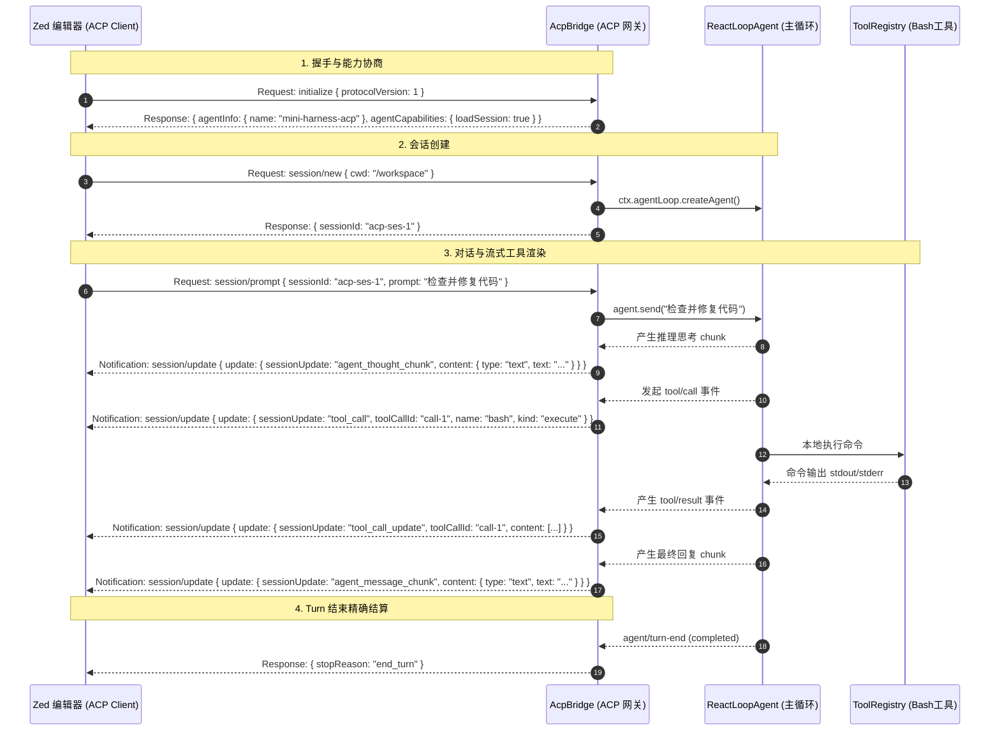
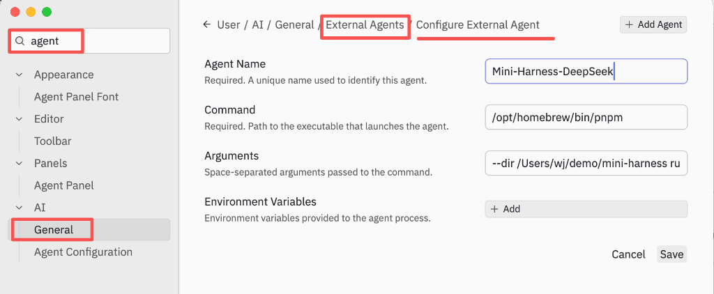
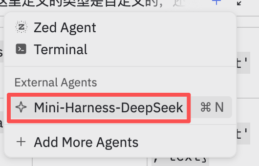
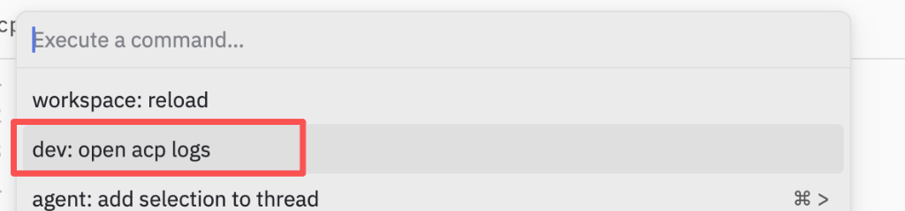

# DeepSeek Coding Agent 从 0 到 1 搭建指南

> **阶段**：Milestone 4 — 现代化 IDE 接入：实现 ACP (Agent Client Protocol) 协议网关，连接 Zed / VSCode 等编辑器  
> **代码仓库**：[mini-harness](file:///Users/wj/demo/mini-harness)  
> **参考来源**：[deepseek-harness](file:///Users/wj/demo/deepseek-harness)

---

## 一、Milestone 4 核心使命与架构全景

在 Milestone 1~3 中，我们构建了完整的微内核容器、本地 Bash 执行器、事件溯源 Session 与持久化存储，并通过终端 Stdio 实现了人机对话。但现代软件工程师的核心生产力工具是 **IDE 编辑器（如 Zed、VSCode）**。

在 **Milestone 4** 中，我们将为 Agent 接入行业前沿的 **Agent Client Protocol (ACP)** 协议标准，让我们的 Agent 能够直接作为一个独立的语言模型后端，入驻 **Zed 等现代化编辑器**！

```
┌─────────────────────────────────────────────────────────────┐
│               Zed / VSCode 等现代化 IDE 客户端               │
│               (渲染实时思考流、打字机正文、工具调用卡片)    │
└──────────────────────────────┬──────────────────────────────┘
                               │  JSON-RPC 2.0 over Stdio (NDJSON)
                               ▼
┌─────────────────────────────────────────────────────────────┐
│                 AcpBridge 桥接网关服务 (Plugin)             │
│   ┌─────────────────────────────────────────────────────┐   │
│   │ 1. initialize: 协商协议版本与能力声明                │   │
│   │ 2. session/new: 创建全新会话与工作区目录 (cwd)       │   │
│   │ 3. session/load: 重水化持久化会话并向 IDE 回放历史   │   │
│   │ 4. session/prompt: 触发 ReAct 循环并单次结算         │   │
│   │ 5. session/cancel: 任务中途取消控制                  │   │
│   │ 6. session/update (广播): 实时推送思考流与工具卡片   │   │
│   └─────────────────────────────────────────────────────┘   │
├─────────────────────────────────────────────────────────────┤
│                    ReAct Agent Loop 引擎                    │
│             (Session ➔ Turn ➔ Step 状态机)                 │
├─────────────────────────────────────────────────────────────┤
│                      微内核容器 (Cordis)                     │
│    Context │ Tools │ Session │ SessionPersistence │ Bash    │
└─────────────────────────────────────────────────────────────┘
```

---

## 二、什么是 Agent Client Protocol (ACP)？

**ACP (Agent Client Protocol)** 是由知名高性能编辑器 **Zed Industries** 发起并开源的下一代 AI 编程智能体通信协议（类似 LSP 语言服务器协议之于代码高亮/补全，ACP 是智能体与编辑器的标准契约）。

### 核心协议设计特征：
1. **传输介质**：基于标准输入输出（`stdio`）的 **Newline-Delimited JSON (NDJSON)**，每行一个合法的 JSON-RPC 2.0 报文。
   > [!IMPORTANT]
   > **核心铁律**：`stdout` 属于协议独占管道！任何用于调试、排查的日志必须输出到 `stderr`（`console.error`），严禁使用 `console.log` 污染 stdout 导致客户端解析崩溃！
2. **多会话多路复用（Multi-Session Multiplexing）**：一个编辑器进程可以打开多个项目窗口或标签页，所有 Session 在单一通信管道中通过 `sessionId` 严格隔离。
3. **富交互卡片更新机制（`session/update`）**：支持将深度思考过程（`agent_thought_chunk`）、回复流（`agent_message_chunk`）、工具发起卡片（`tool_call`）与工具执行结果（`tool_call_update`）结构化分流渲染。

---

## 三、ACP 核心交互生命周期时序图



---

## 四、历史会话加载与历史卡片回放 (`session/load`)

当用户在编辑器中重新打开一个已有会话时：
1. 编辑器向服务端发起 `session/load { sessionId: "...", cwd: "..." }`；
2. 服务端通过 [`ctx.agentLoop.resumeAgent(sessionId)`](file:///Users/wj/demo/mini-harness/src/agent-loop/index.ts#L238) 从底层持久化存储（JSONL / SQLite）中还原事件流；
3. **关键回放机制（History Replay）**：网关遍历历史事件，按顺序向编辑器推送 `session/update` 广播：
   * `user/message` ➔ `user_message_chunk`
   * `assistant/message (text)` ➔ `agent_message_chunk`
   * `assistant/message (reasoning)` ➔ `agent_thought_chunk`
   * `tool/call` + `tool/result` ➔ `tool_call` 与 `tool_call_update`
4. 编辑器接收到回放数据后，即可**完整还原会话上下文卡片**，让用户在 IDE 视图中无缝接着聊！

---

## 五、在 Zed 编辑器中配置并接入 Mini Harness

### 1. 配置 Zed

你可以通过 **Zed 可视化设置界面** 或 **`settings.json` 配置文件** 两种方式进行接入。

#### 方式 A：通过 Zed 图形化界面配置（推荐）

1. 打开 Zed 的设置（快捷键 `Cmd + ,`）；
2. 在左侧栏定位至 **AI** ➔ **General**（或直接在搜索框输入 `agent`）；
3. 在 **External Agents** 区域点击 **Configure External Agent**（或 **Add Custom Agent**）；
4. 按照如下配置进行填写：



* **表单字段配置明细**：
  * **Agent Name**：`Mini-Harness-DeepSeek`（自定义唯一标识名称）；
  * **Command**：`/opt/homebrew/bin/pnpm`（建议填绝对路径，避免 Zed 启动子进程缺少 PATH 环境变量）；
  * **Arguments**：`--dir /Users/wj/demo/mini-harness run demo:acp`（切换工作区并启动 ACP Server）；
  * **Environment Variables**：*(可选)* 点击 `+ Add` 显式设置环境变量（若项目根目录下已有 `.env` 则会自动加载）。

#### 方式 B：通过 `settings.json` 配置文件

打开 Zed 的配置文件（`~/.config/zed/settings.json` 或 `Cmd + Shift + P` 输入 `zed: open settings`）：
在 `agent_servers` 中添加配置：

```json
{
  "agent_servers": {
    "Mini-Harness-DeepSeek": {
      "command": "/opt/homebrew/bin/pnpm",
      "args": ["--dir", "/Users/wj/demo/mini-harness", "run", "demo:acp"]
    }
  }
}
```

---

### 2. 在 Zed 中选择并使用 Agent

1. 打开任意项目工作区；
2. 打开 Zed 右侧的 **Agent Panel**（或通过快捷键呼出对话面板）；
3. 点击顶部的 Agent 切换下拉框，在 **External Agents** 列表中选中 **`Mini-Harness-DeepSeek`**：



4. 在输入框中输入开发任务（如：*“请分析 types.ts 中的类型定义并运行测试”*），即可享受在原生编辑器中指挥 DeepSeek Coding Agent 编写、调试、测试代码的流畅体验！

---

## 六、ACP 调试与日志排障指南（如果 Agent 未正常回复）

在对接 ACP 协议过程中，若遇到 **“Agent 有返回但左侧聊天框不显示”**、**“Failed to Launch: Loading or resuming sessions is not supported”** 或报错中断时，可按以下方式进行高效调试与排查：

### 1. 使用 Zed 专属 ACP 协议抓包视图 (`dev: open acp logs`)

这是排查 ACP 报文传输与反序列化问题最直观的利器：

1. 在 Zed 中按下快捷键 **`Cmd + Shift + P`**；
2. 输入 **`dev: open acp logs`** 并回车：



3. Zed 会在右侧开启专属的 **ACP 协议追踪面板**，实时展示收发的所有 JSON-RPC 2.0 报文（如下图所示）：
   * 可以观察 `initialize`、`session/new`、`session/update` 及 `session/prompt` 的原始载荷；
   * 若界面出现 `[unrecognized response]` 或黄色告警，说明载荷结构存在不匹配。

---

### 2. 查看 Zed 系统级日志

Zed 会将 Agent 进程输出在 `stderr` 上的诊断日志以及 Rust 反序列化异常写入系统日志：
* **在 Zed 中查看**：`Cmd + Shift + P` ➔ 输入 `zed: open log`；
* **在终端实时监听**：
  ```bash
  tail -f ~/Library/Logs/Zed/Zed.log | grep -E "acp|agent"
  ```
  > 若看到 `missing field sessionUpdate` 或 `missing field agentCapabilities`，即可迅速定位缺失的字段。

---

### 3. 注意 Zed 的常驻进程（Keep-Alive）机制

Zed 为降低进程拉起开销，会**在后台常驻 Agent 守护子进程**。修改 Agent 服务端代码后，需手动终止老进程以使新代码生效：

```bash
# 检查并清理驻留的老 ACP 服务端进程
ps aux | grep "demo/acp.ts" | grep -v grep | awk '{print $2}' | xargs kill -9
```

---

## 七、核心代码逻辑与工业级避坑设计

在 Milestone 4 的落地过程中，我们总结并实现了以下几条关键的协议与微内核设计规范：

### 1. ACP 协议标准的严格对齐规范

根据 Zed 官方 Rust `agent_client_protocol` 反序列化器的要求，[`src/acp/bridge.ts`](file:///Users/wj/demo/mini-harness/src/acp/bridge.ts) 必须严格遵循以下标准：

```typescript
// ① 实时思考流 (Reasoning Chunk)
this.notifyUpdate(sessionId, {
  sessionUpdate: 'agent_thought_chunk',
  type: 'agent_thought_chunk',
  content: { type: 'text', text: chunk.text },
})

// ② 打字机正文流 (Message Chunk)
this.notifyUpdate(sessionId, {
  sessionUpdate: 'agent_message_chunk',
  type: 'agent_message_chunk',
  content: { type: 'text', text: chunk.text },
})

// ③ 工具调用发起卡片 (Tool Call)
this.notifyUpdate(sessionId, {
  sessionUpdate: 'tool_call',
  type: 'tool_call',
  toolCallId: call.id,
  callId: call.id,
  name: call.name,
  title: `${call.name} (${JSON.stringify(call.arguments)})`,
  kind: 'execute',
  status: 'in_progress',
  rawInput: call.arguments,
})

// ④ 工具执行结果回填 (Tool Call Update)
this.notifyUpdate(sessionId, {
  sessionUpdate: 'tool_call_update',
  type: 'tool_call_update',
  toolCallId: res.callId,
  callId: res.callId,
  status: res.isError ? 'failed' : 'completed',
  content: [{ type: 'content', content: { type: 'text', text: res.content } }],
  isError: res.isError,
})
```

* **避坑要点**：
  1. 必须携带 **`sessionUpdate`** 标签字段作为 Rust Serde 鉴别器；
  2. 文本分片的内容必须是结构化的 **`ContentBlock` 对象**（`{ type: 'text', text: '...' }`），不能是裸字符串；
  3. 工具调用 ID 必须为 **`toolCallId`**。

---

### 2. 握手能力协商与 `agentCapabilities`

在处理 `initialize` RPC 请求时，必须声明 [`agentCapabilities`](file:///Users/wj/demo/mini-harness/src/acp/types.ts#L104-L112)：

```typescript
this.conn.onRequest('initialize', async (): Promise<AcpInitializeResult> => {
  return {
    protocolVersion: 1,
    agentInfo: { name: this.serverName, version: this.serverVersion },
    agentCapabilities: {
      loadSession: true, // 明确声明支持 session/load 与跨进程会话恢复
    },
  }
})
```

> [!WARNING]
> 若未显式返回 `agentCapabilities: { loadSession: true }`，Zed 会判定该 Agent 不具备会话重水化能力，并在打开已有对话时报错 `Failed to Launch: Loading or resuming sessions is not supported by this agent`。

---

### 3. 微内核可选软依赖动态查找 (`ctx.get`)

在 [`src/agent-loop/index.ts`](file:///Users/wj/demo/mini-harness/src/agent-loop/index.ts#L239) 与 [`src/acp/bridge.ts`](file:///Users/wj/demo/mini-harness/src/acp/bridge.ts#L117) 中获取持久化服务时：

```typescript
// 推荐范式：动态软依赖获取
const persistence = this.ctx.get('sessionPersistence') as SessionPersistence | undefined
if (!persistence) {
  throw new Error('SessionPersistence service (ctx.sessionPersistence) is not registered')
}
```

* **原理解析**：
  * `sessionPersistence` 是可选插件，未声明在 `static inject` 中；
  * 若直接使用 `this.ctx.sessionPersistence`，Cordis 的作用域 Proxy 会在未加载插件时抛出 `cannot get property without inject` 导致原本的防御性 `if` 分支失效；
  * 改用 `this.ctx.get('sessionPersistence')` 可安全返回 `undefined`，实现优雅的降级和准确的业务错误提示。

---

## 八、Milestone 4 代码文件清单

| 文件路径 | 职责与作用 |
| :--- | :--- |
| [`src/acp/types.ts`](file:///Users/wj/demo/mini-harness/src/acp/types.ts) | JSON-RPC 2.0 基础类型、ACP 协议模型、`sessionUpdate` 联合体与编解码器 |
| [`src/acp/connection.ts`](file:///Users/wj/demo/mini-harness/src/acp/connection.ts) | 健壮的 NDJSON 行级流解析与双工 JSON-RPC 通信引擎 |
| [`src/acp/bridge.ts`](file:///Users/wj/demo/mini-harness/src/acp/bridge.ts) | [`AcpBridge`](file:///Users/wj/demo/mini-harness/src/acp/bridge.ts#L50) 微内核网关插件（多会话路由、事件分发、历史卡片回放） |
| [`src/acp/index.ts`](file:///Users/wj/demo/mini-harness/src/acp/index.ts) | 导出 ACP 模块 |
| [`src/demo/acp.ts`](file:///Users/wj/demo/mini-harness/src/demo/acp.ts) | 面向 Zed / IDE 的生产级 ACP Server 启动入口 (`pnpm run demo:acp`) |
| [`tests/acp.spec.ts`](file:///Users/wj/demo/mini-harness/tests/acp.spec.ts) | 涵盖 initialize、new、prompt 流式推送与 load 历史回放的自动化测试套件 (3 tests) |

---
*文档生成于 [`mini-harness`](file:///Users/wj/demo/mini-harness) Milestone 4 演进阶段。*
