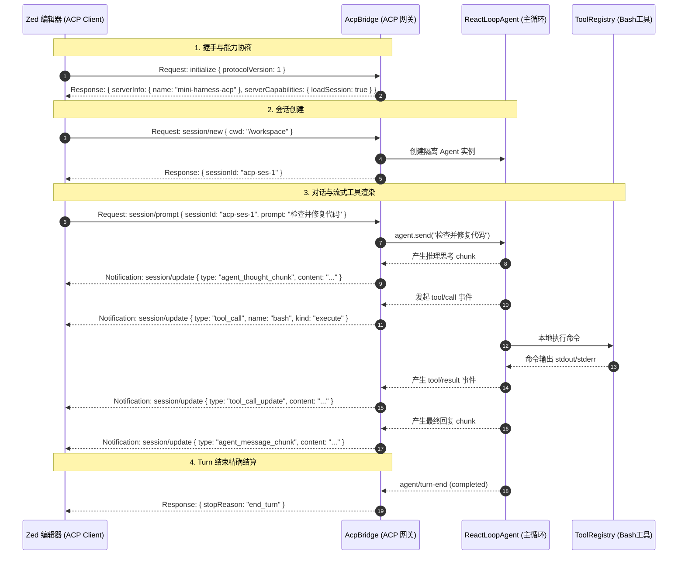

# DeepSeek Coding Agent 从 0 到 1 搭建指南

> **阶段**：Milestone 4 — 现代化 IDE 接入：实现 ACP (Agent Client Protocol) 协议网关，连接 Zed / VSCode 等编辑器  
> **代码仓库**：[mini-harness](file:///Users/wj/demo/mini-harness)  
> **参考来源**：[deepseek-harness](file:///Users/wj/demo/deepseek-harness)

---

## 一、Milestone 4 核心使命与架构全景

在 Milestone 1~3 中，我们构建了完整的微内核、本地 Bash 执行器、事件溯源 Session 与持久化存储，并通过终端 Stdio 实现了人机对话。但现代软件工程师的核心生产力工具是 **IDE 编辑器（如 Zed、VSCode）**。

在 **Milestone 4** 中，我们将为 Agent 接入行业前沿的 **Agent Client Protocol (ACP)** 协议标准，让我们的 Agent 能够直接作为一个独立的语言模型后端，入驻 **Zed 等现代化编辑器**！

```
┌─────────────────────────────────────────────────────────────┐
│               Zed / VSCode 等现代化 IDE 客户端               │
│               (渲染实时思考流、打字机正文、工具调用卡片)    │
└──────────────────────────────┬──────────────────────────────┘
                               │  JSON-RPC 2.0 over Stdio (NDJSON)
                               ▼
┌─────────────────────────────────────────────────────────────┐
│                 AcpBridge 桥接网关服务 (Plugin)             │
│   ┌─────────────────────────────────────────────────────┐   │
│   │ 1. initialize: 协商协议版本与加载能力                │   │
│   │ 2. session/new: 创建全新会话与工作区目录 (cwd)       │   │
│   │ 3. session/load: 重水化持久化会话并向 IDE 回放历史   │   │
│   │ 4. session/prompt: 触发 ReAct 循环并单次结算         │   │
│   │ 5. session/cancel: 任务中途取消控制                  │   │
│   │ 6. session/update (广播): 实时推送思考流与工具卡片   │   │
│   └─────────────────────────────────────────────────────┘   │
├─────────────────────────────────────────────────────────────┤
│                    ReAct Agent Loop 引擎                    │
│             (Session ➔ Turn ➔ Step 状态机)                 │
├─────────────────────────────────────────────────────────────┤
│                      微内核容器 (Cordis)                     │
│    Context │ Tools │ Session │ SessionPersistence │ Bash    │
└─────────────────────────────────────────────────────────────┘
```

---

## 二、什么是 Agent Client Protocol (ACP)？

**ACP (Agent Client Protocol)** 是由知名高性能编辑器 **Zed Industries** 发起并开源的下一代 AI 编程智能体通信协议（类似 LSP 语言服务器协议之于代码高亮/补全，ACP 是智能体与编辑器的标准契约）。

### 核心协议设计特征：
1. **传输介质**：基于标准输入输出（`stdio`）的 **Newline-Delimited JSON (NDJSON)**，每行一个合法的 JSON-RPC 2.0 报文。
   > ⚠️ **核心铁律**：`stdout` 属于协议独占管道！任何用于调试、排查的日志必须输出到 `stderr`（`console.error`），严禁使用 `console.log` 污染 stdout 导致客户端解析崩溃！
2. **多会话多路复用（Multi-Session Multiplexing）**：一个编辑器进程可以打开多个项目窗口或标签页，所有 Session 在单一通信管道中通过 `sessionId` 严格隔离。
3. **富交互卡片更新机制（`session/update`）**：支持将深度思考过程（`agent_thought_chunk`）、回复流（`agent_message_chunk`）、工具发起卡片（`tool_call`）与工具执行结果（`tool_call_update`）结构化分流渲染。

---

## 三、ACP 核心交互生命周期时序图



---

## 四、历史会话加载与历史卡片回放 (`session/load`)

当用户在编辑器中重新打开一个已有会话时：
1. 编辑器向服务端发起 `session/load { sessionId: "...", cwd: "..." }`；
2. 服务端通过 `ctx.agentLoop.resumeAgent(sessionId)` 从底层持久化存储（JSONL / SQLite）中还原事件流；
3. **关键回放机制（History Replay）**：网关遍历历史事件，按顺序向编辑器推送 `session/update` 广播：
   * `user/message` ➔ `user_message_chunk`
   * `assistant/message (text)` ➔ `agent_message_chunk`
   * `assistant/message (reasoning)` ➔ `agent_thought_chunk`
   * `tool/call` + `tool/result` ➔ `tool_call` 与 `tool_call_update`
4. 编辑器接收到回放数据后，即可**完整还原会话上下文卡片**，让用户在 IDE 视图中无缝接着聊！

---

## 五、在 Zed 编辑器中配置并接入 Mini Harness

### 1. 配置 Zed
打开 Zed 的设置文件（`~/.config/zed/settings.json` 或 `Cmd + ,`）：
在 `agent_servers` 中添加你的 Mini Harness 服务配置：

```json
{
  "agent_servers": {
    "Mini Harness (DeepSeek)": {
      "command": "pnpm",
      "args": ["--dir", "/Users/wj/demo/mini-harness", "run", "demo:acp"]
    }
  }
}
```

### 2. 在 Zed 中使用
1. 打开任意项目目录；
2. 打开 Zed 右侧的 **Assistant Panel**；
3. 选择 **Mini Harness (DeepSeek)** 作为当前 Agent；
4. 开始输入任务，享受在现代化原生编辑器中指挥 DeepSeek Coding Agent 编写、调试、测试代码的流畅体验！

---

## 六、Milestone 4 代码文件清单

| 文件路径 | 职责与作用 |
| :--- | :--- |
| [`src/acp/types.ts`](file:///Users/wj/demo/mini-harness/src/acp/types.ts) | JSON-RPC 2.0 基础类型、ACP 协议模型与纯 Codec 转换函数 |
| [`src/acp/connection.ts`](file:///Users/wj/demo/mini-harness/src/acp/connection.ts) | 健壮的 NDJSON 行级流解析与双工 JSON-RPC 通信引擎 |
| [`src/acp/bridge.ts`](file:///Users/wj/demo/mini-harness/src/acp/bridge.ts) | AcpBridge 微内核网关插件（多会话路由、事件分发、历史回放） |
| [`src/acp/index.ts`](file:///Users/wj/demo/mini-harness/src/acp/index.ts) | 导出 ACP 模块 |
| [`src/demo/acp.ts`](file:///Users/wj/demo/mini-harness/src/demo/acp.ts) | 面向 Zed / IDE 的生产级 ACP Server 启动入口 (`pnpm run demo:acp`) |
| [`tests/acp.spec.ts`](file:///Users/wj/demo/mini-harness/tests/acp.spec.ts) | 涵盖 initialize、new、prompt 流式推送与 load 历史回放的自动化测试套件 (3 tests) |

---
*文档生成于 `/Users/wj/demo/mini-harness` Milestone 4 演进阶段。*
