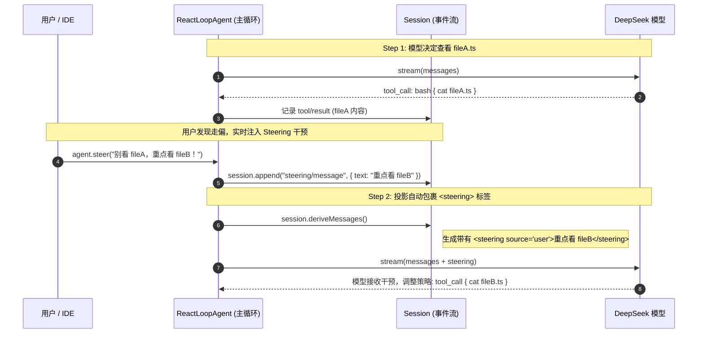
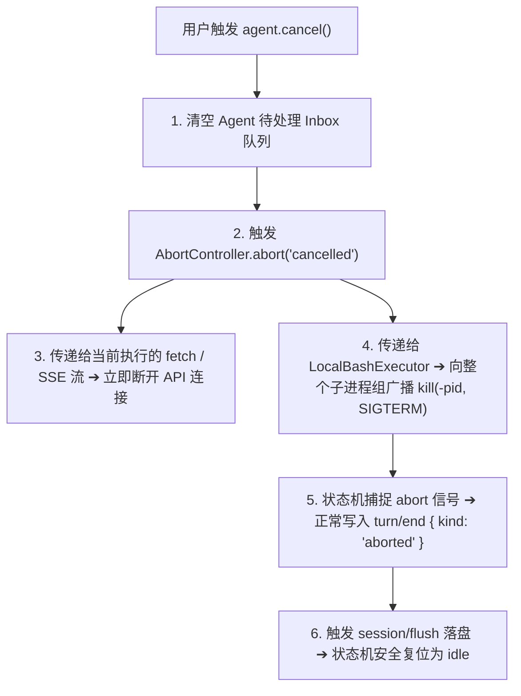

# DeepSeek Coding Agent 从 0 到 1 搭建指南

> **阶段**：Milestone 5 — 系统韧性与高级控制：Invariants 不变量契约校验、中途打断 Steering、优雅取消 Cancellation 与生产收尾  
> **代码仓库**：[mini-harness](file:///Users/wj/demo/mini-harness)  
> **参考来源**：[deepseek-harness](file:///Users/wj/demo/deepseek-harness)

---

## 一、Milestone 5 核心使命与系统成熟度跃迁

在经历了 Milestone 1（内核与骨架）、Milestone 2（真实模型与执行器）、Milestone 3（工业级持久化）和 Milestone 4（现代化 IDE ACP 接入）之后，我们的 Coding Agent 已经具备了完整的端到端功能。

在最后一个阶段 **Milestone 5** 中，我们将为系统筑起**生产级韧性（System Resilience）与高级交互控制**的三道护城河：
1. **运行时不变量校验守卫（Invariants Guard）**：在事件流级别主动拦截序号断层、非法状态机跳转，并实施不可变深度冻结（Deep Freeze）；
2. **中途干预与航向纠偏（Mid-turn Steering）**：支持用户在 Agent 多步执行中途直接注入修正指令（`<steering>` 标签），无需打断整个 Turn 即可实时修正行动路线；
3. **级联取消与优雅中断（Graceful Cancellation）**：打通 UI 取消按钮 ➔ AbortSignal ➔ 本地 Bash 进程组级联清理（Kill Process Group）➔ 状态机安全回落闭环；
4. **全阶段生产级测试与收尾**：全套 21 个自动化测试用例，构建一个健壮、优雅、高可用的工业级 Agent 框架。

```
┌─────────────────────────────────────────────────────────────┐
│                    生产级交互与控制表面                     │
│         (Stdio CLI / ACP Editor / Steering / Cancel)        │
├─────────────────────────────────────────────────────────────┤
│                    ReAct Agent Loop 引擎                    │
│    (支持 Mid-turn Steering 动态注入 & AbortSignal 级联取消) │
├─────────────────────────────────────────────────────────────┤
│                Invariants 运行时状态机契约守护              │
│       (序号单调递增 │ 状态机边界闭环 │ 事件 Deep Freeze)     │
├─────────────────────────────────────────────────────────────┤
│                 SessionPersistence 统一持久化 Seam          │
│               (Write-Behind 缓冲池 + 崩溃恢复修补)           │
├─────────────────────────────────────────────────────────────┤
│                      微内核容器 (Cordis)                     │
│    Context │ Tools │ Session │ Bash │ LLM │ ACP │ Agents    │
└─────────────────────────────────────────────────────────────┘
```

---

## 二、运行时不变量校验与不可变冻结（Invariants Guard）

在事件溯源系统中，**事件流就是整个 Agent 的唯一事实来源（Single Source of Truth）**。如果由于插件 Bug 或异步竞态条件导致事件流出现哪怕一个微小的错误（如序号跳跃、Turn 嵌套错乱），整个状态机和历史消息投影就会彻底崩溃。

[`src/invariants/index.ts`](file:///Users/wj/demo/mini-harness/src/invariants/index.ts) 实现了极低开销的运行时防空网：

### 1. 核心校验规则
* **连续单调自增序号（`seq Contiguity`）**：严格断言 `event.seq === lastSeq + 1`，彻底阻断并发追加导致的序号丢失或重复；
* **严格 Turn / Step 生命周期**：
  * 禁止在未闭合 Turn 时开启新 Turn；
  * 禁止在 Turn 外部启动 Step；
  * 步骤级事件（`assistant/chunk`, `tool/call`, `tool/result`）必须严格属于当前打开的 `openTurn` 和 `openStep`；
* **工具调用闭环断言**：`tool/result` 必须严格匹配前序发起的 `tool/call` 的 `callId`。

### 2. 深度不可变冻结（Deep Freeze）
* 任何通过 `session.append()` 追加的事件，Invariants 插件都会使用 `deepFreeze()` 递归锁定其所有属性与子对象；
* 如果任何第三方插件或 UI 层试图原地修改历史事件（例如 `event.data.content[0].text = "..."`），Node.js 会直接抛出 `TypeError: Cannot assign to read only property`，**彻底杜绝历史被静默篡改的隐患**！

---

## 三、中途干预与航向纠偏（Mid-turn Steering）

在复杂的 Coding 任务中，Agent 可能会进行长达 5~10 步的探索（例如 `step 1: 查看目录` ➔ `step 2: 正在读错的文件`）。如果用户在此时发现 Agent 走偏了：
* **传统粗暴做法**：只能全部强行 Cancel，之前的思考与探索全部作废，重新发送一大段指令；
* **Steering 航向纠偏模式**：用户调用 `agent.steer("别改那个文件，改 utils.ts！")`，系统在当前正在执行的 Turn 中追加一条 `steering/message` 事件。



---

## 四、级联取消与优雅中断（Graceful Cancellation）

当用户点击界面的 Stop 按钮或按下 `Ctrl+C` 时，系统必须干净、彻底地清理所有资源：



---

## 五、全套 21 个自动化测试与质量守门

在 `mini-harness` 中，我们构建了 9 个测试套件，全面覆盖框架的每一个核心特性：

```bash
cd /Users/wj/demo/mini-harness
pnpm test
```

### 测试矩阵概览：
1. `tests/echo.spec.ts`: ReAct 主循环状态机与两阶段工具调用（1 test）
2. `tests/bash.spec.ts`: Bash 执行器、进程组隔离、超时强杀与 64KB 截断（5 tests）
3. `tests/deepseek-adapter.spec.ts`: 真实 DeepSeek API SSE 协议与 Function Calling 序列化（2 tests）
4. `tests/session-persistence.spec.ts`: JSONL 与 SQLite 双后端通用持久化契约（4 tests）
5. `tests/resume.spec.ts`: 跨进程持久化与无缝断点续聊端到端验证（1 test）
6. `tests/acp.spec.ts`: ACP 现代化 IDE 协议网关、流式卡片与历史回放（3 tests）
7. `tests/invariants.spec.ts`: 运行时序号单调性、状态机边界与 Deep Freeze 冻结（3 tests）
8. `tests/steering.spec.ts`: 中途干预 `<steering>` 消息派生与动态纠偏（1 test）
9. `tests/cancellation.spec.ts`: 任务级联取消与优雅中断（1 test）

**共计 21 个测试全部绿灯通过！**

---

## 六、Milestone 5 代码文件清单

| 文件路径 | 职责与作用 |
| :--- | :--- |
| [`src/invariants/index.ts`](file:///Users/wj/demo/mini-harness/src/invariants/index.ts) | 运行时不变量守卫（`seq` 校验、状态机闭环、`deepFreeze` 事件不可变冻结） |
| [`src/agent/index.ts`](file:///Users/wj/demo/mini-harness/src/agent/index.ts) | 扩展 `Agent.steer()` 接口规范 |
| [`src/agent-loop/index.ts`](file:///Users/wj/demo/mini-harness/src/agent-loop/index.ts) | 主循环支持 `steer()` 动态注入与 `cancel()` 级联中断 |
| [`tests/invariants.spec.ts`](file:///Users/wj/demo/mini-harness/tests/invariants.spec.ts) | 不变量校验与深度冻结自动化测试 (3 tests) |
| [`tests/steering.spec.ts`](file:///Users/wj/demo/mini-harness/tests/steering.spec.ts) | Mid-turn Steering 动态干预自动化测试 (1 test) |
| [`tests/cancellation.spec.ts`](file:///Users/wj/demo/mini-harness/tests/cancellation.spec.ts) | 优雅取消与进程组级联清理测试 (1 test) |

---
*文档生成于 `/Users/wj/demo/mini-harness` Milestone 5 终章阶段。*
