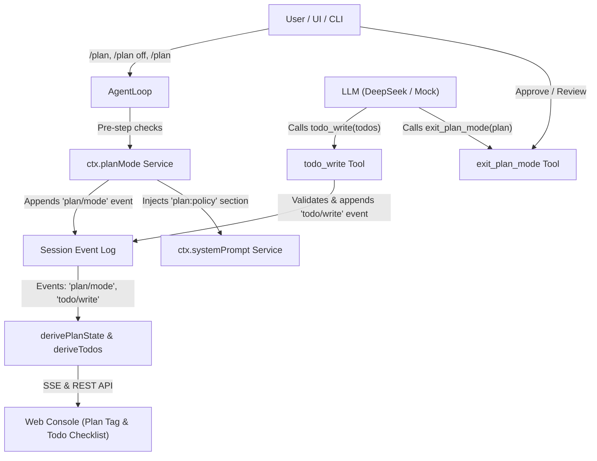

# Milestone 9 Design Spec: Plan Mode & Structured Todo Tracking

- **Date**: 2026-09-30
- **Author**: Antigravity & User
- **Status**: Approved
- **Reference**: Official `deepseek-harness` packages (`packages/plan/plan-mode`, `packages/todo/tool-todo`)

---

## 1. Executive Summary

Milestone 9 brings structured, inspectable, and human-aligned execution control to Mini Harness by introducing two first-class capabilities inspired by official DeepSeek Harness:
1. **Plan Mode (`src/plan/`)**: A logged collaboration state where the agent is constrained by policy to explore, analyze, and design a comprehensive plan before execution. The agent submits the plan via `exit_plan_mode(plan: string)` for review or approval.
2. **Structured Todo Tracking (`src/todo/`)**: A model-facing tool `todo_write(todos: TodoItem[])` where the agent maintains a live, whole-list task checklist with deterministic event-sourced tracking and UI projection.

---

## 2. Architecture & Capability Seams

### 2.1 Component Diagram



---

## 3. Detailed Specifications

### 3.1 Session Event Log Additions (`src/types/session.ts`)

Two new append-only event types are added to `SessionEventMap`:

```typescript
export interface PlanModeEvent {
  active: boolean;
  reason?: 'user_command' | 'plan_approved' | 'plan_off' | 'initial';
}

export interface TodoItem {
  id?: string;
  content: string;
  status: 'pending' | 'in_progress' | 'completed';
}

export interface TodoWriteEvent {
  todos: TodoItem[];
}

declare module './session.js' {
  interface SessionEventMap {
    'plan/mode': PlanModeEvent;
    'todo/write': TodoWriteEvent;
  }
}
```

### 3.2 Plan Mode Subsystem (`src/plan/`)

1. **`PlanModeController` (Cordis Service)**:
   - Registers service name `planMode`.
   - Maintains per-session pending state awaiting step boundaries (`pendingIntents`).
   - Hooks into `agent-loop`:
     - Intercepts `/plan`, `/plan off`, and `/plan <instruction>` user commands.
     - Injects `plan:policy` prompt section via `ctx.systemPrompt` when `active === true`.
     - Appends `plan/mode` event at the step boundary (`pre-step`).
   - Provides methods:
     - `isActive(session: Session): boolean`
     - `set(session: Session, active: boolean, reason?: string): 'committed' | 'queued'`
     - `setApprovalHandler(handler: (plan: string, session: Session) => Promise<PlanApprovalDecision>): void`
2. **`exit_plan_mode` Tool**:
   - Parameters:
     - `plan`: string (Markdown starting with `# Heading`).
   - Invariants:
     - Throws if called when `planMode.isActive()` is false.
     - Throws if `plan` does not start with `# Heading`.
   - Execution:
     - Calls configured `approvalHandler` (default: auto-approves in tests/headless mode, or raises review event in Web UI).
     - On approval: sets pending active = false, returns `{ approved: true }`.
     - On keep planning: throws user feedback message so model revises plan in the next step.

### 3.3 Todo Subsystem (`src/todo/`)

1. **`todo_write` Tool**:
   - Parameters:
     - `todos`: `Array<{ content: string; status: 'pending' | 'in_progress' | 'completed' }>`
   - Policy & Invariants:
     - **Whole-list replacement**: Every call replaces the complete list.
     - **Validation**:
       - `content` must be a non-empty trimmed string.
       - No duplicate `content` entries allowed.
       - `status` must be one of `'pending'`, `'in_progress'`, `'completed'`.
     - **Concurrency Discipline**:
       - When `config.allowParallelInProgress === false` (default), at most one item can be `in_progress`.
       - When `config.allowParallelInProgress === true`, multiple items can be `in_progress`.
   - Result:
     - Appends `todo/write` event to session log.
     - Returns summary string: `Updated todo list: X pending, Y in progress, Z completed.`

### 3.4 Web Console & Visual Projections

1. **SSE & State API**:
   - Sessions list and session detail API expose `planMode` (`{ active: boolean }`) and `todos` (`TodoItem[]`).
2. **UI Components**:
   - **Plan Status Pill**: Shows `[PLAN MODE]` indicator when active, with exit button.
   - **Todo Checklist Panel**: Collapsible side/top card rendering items with checkbox states, strike-through for completed, animated spinner for in-progress, and progress bar (`X/Y finished`).

---

## 4. Testing Strategy

1. **Unit Tests (`tests/plan-and-todo.spec.ts`)**:
   - `planMode`: `/plan` command, `/plan off`, pending step queue, prompt injection.
   - `exit_plan_mode`: validation of `# Heading`, error when not in plan mode, approval vs rejection feedback.
   - `todo_write`: whole-list replacement, validation (empty, duplicate, invalid status), parallel vs single in-progress constraint.
   - Persistence & Replay: verifying that replaying events reconstructs the correct plan and todo state.
